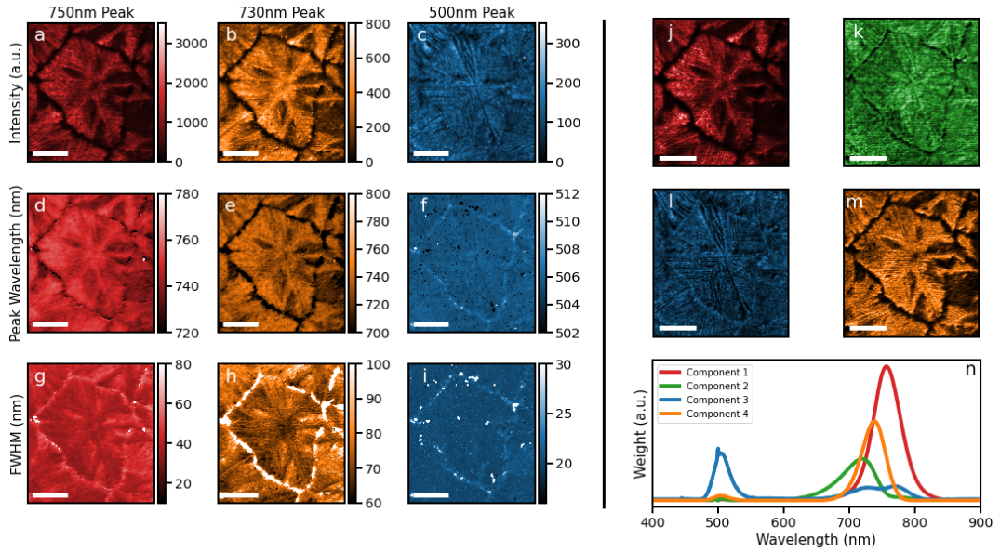
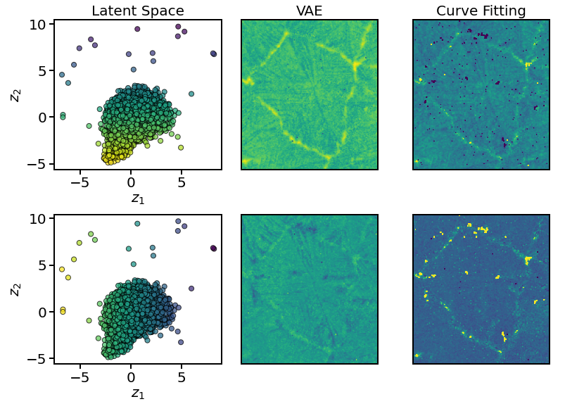

# Perovskite Analysis

The notebook in this repository shows some of the code I wrote during my internship at Oak Ridge National Laboratory (ORNL). What follows in this readme is a description of what the notebook accomplishes and some general commentary on the use of the methods it contains. The dataset used here was obtained from the cathodoluminescence of a perovskite thin film.

## Brief Background

### Hyperspectral Cathodoluminscence
When the electron beam in a scanning electron microscope (SEM) is incident upon the surface of a material, it can cause the material to emit light (the cathode will be luminescent). In the present case, we are concerned with light in the visible spectrum. In standard scanning electron microscopy, an electron beam is focused onto a specific portion of a sample for a constant amount of time (the dwell time) and data is collected on the number of secondary electrons detected. This is the process by which one pixel is produced in a SEM image. The process is repeated in the pattern of a raster scan until the entire surface of interest is imaged.

In hyperspectral cathodoluminescence (CL) microscopy, we use the same process of scanning electron microscopy as described above, however, we have the additional functionality of obtaining the spectrum of the light emitted when the electron beam dwells at a particular location on the sample. This process is used for each pixel in the SEM image, so we therefore have one spectrum for every pixel in the SEM image; this is what is called a hyperspectral image.

### Hyperspectral Datasets

The datasets produced from hyperspectral CL are three-dimensional; for each wavelength value in the visible spectrum (in the case here it is discretized into 1024 different wavelength values evenly spaced over the visible spectrum), we have one image. 

## Methods

Once the hyperspectral dataset is obtained, the rest is simply a matter of extracting the relevant information from the dataset, and this is what this notebook is concerned with. The simplest way to get a general idea as to the features of the sample are to simply view some sample spectra to see what features are in the spectra (e.g. maybe a certain peak is of interest) and then view the CL image at that particular wavelength. In the case here, however, we take a more detailed look at the data and get information on peak broadening, redshifting, and intensity changes as a function of position for all peaks in the spectra.

### 1. Curve Fitting

The method here is to simply fit a user defined curve (e.g. a Gaussian or a Lorentzian) to every spectrum in the hyperspectral dataset. For each peak, we then get the intensity, full width half maximum (FWHM) and central peak location as a function of position.

### 2. Non-Negative Matrix Factorization (NMF)

NMF can be simply applied to the dataset for any given number of components; it is able to extract the intensity plots of each peak even when peaks overlap, and often times it picks out features of interest.

### 3. Variational Autoencoder (VAE)

After obtaining the intensity plots of a given peak with NMF, we can normalize each of the peaks to reduce each peak to only having two parameters that vary (FWHM and central value). The VAE can then separate these two parameters among two latent dimensions, and we can correlate the latent dimensions to the parameters of the curve.

## Results

The plot below shows the results of curve fitting and NMF with 4 components.

We see excellent agreement between the intensity plots obtained through curve fitting (a-c) and those obtained with NMF (j,m,l respectively). Now when applying the VAE on the normalized 500nm peak, we get the following plots (also shown are the plots obtained from curve fitting for comparison):

The top row shows the plots colored according to their Z2 coordinates, which we determine (in the Jupyter Notebook) is correlated with redshifting. In the top row, we see pretty good agreement between the redshifting plot obtained with the VAE and that obtained through curve fitting; the only large difference is the VAE plot simply has a higher background level, which is not relevant as to the physics of the material anyway. Otherwise, the VAE extracts all the relevant features. 

In the bottom row, we color the points according to their Z1 coordinate to get information on peak broadening. In the Jupyter Notebook, it is shown that this dimension does not coordinate very well with peak broadening, so the resulting plot does not match up noteably well with the plots from curve fitting.

## Conclusion

NMF and VAE appears to be effective at extracting *qualitative* information on intensity and redshifting, but is less effective at getting information on peak broadening. The combination of NMF and VAE is easier to code, more robust, and more computationally efficient than curve fitting. Additional research can be done to sample the latent space points to obtain *quantitative* information about the physical parameters that the latent space parameters represent.
